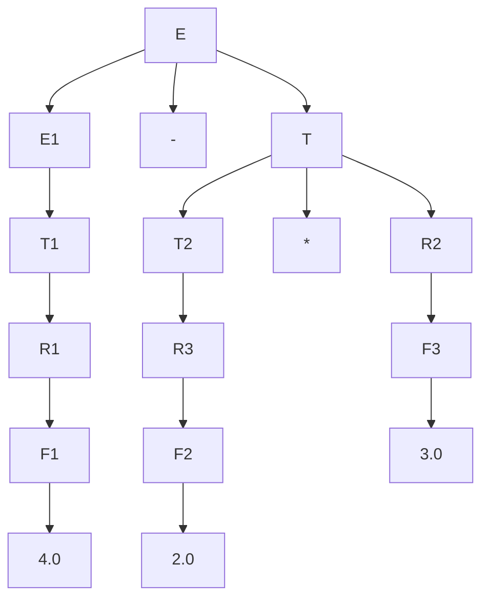
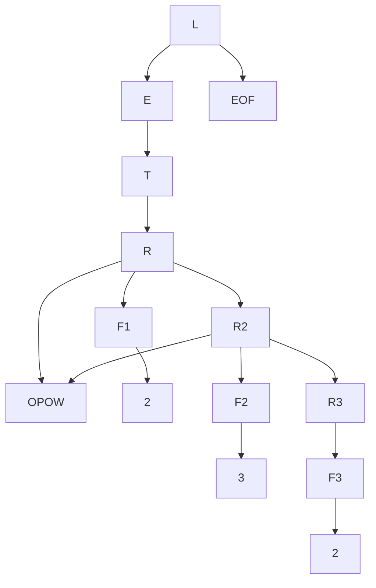
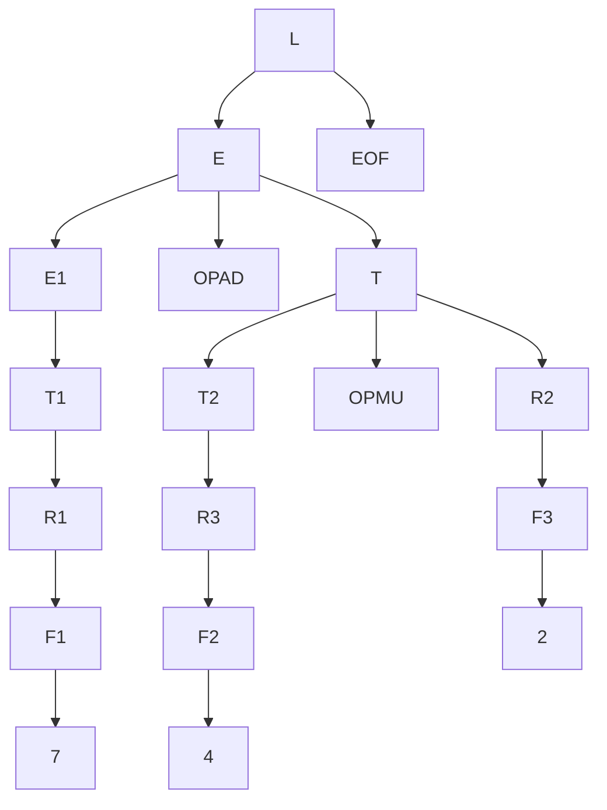

# Entorno de desarrollo

## Procesadores de Lenguajes

- Este repositorio contiene todo el trabajo desarrollado en la **práctica 05** de la asignatura **Procesadores de Lenguajes** del grado de Ingeniería Informática que se cursa en la Universidad de La Laguna. 
- A su vez, este informe documenta el trabajo realizado para la práctica.
- Autor - _Cristhian Cruz Delgado_
- Fecha - _19 Feb 2026_

### 0. Configurar proyecto

El desarrollo de la práctica ha sido trabajado en la máquina virtual **PL2526-30**.

Se recomienda trabajar desde tu máquina local conectándote de forma remota a la máquina virtual mediante entornos de desarrollo como VSCode.

Una vez en el entorno de trabajo, compila y prueba que los test funcionen correctamente.

Para compilar y probar test ejecute:

- $ npx jison src/grammar.jison -o src/parser.js
- $ npm test

```
drwxrwxr-x 217 usuario usuario 12288 feb 25 09:58 node_modules
-rw-rw-r--   1 usuario usuario 1258 feb 25 09:55 package.json
-rw-rw-r--   1 usuario usuario 166986 feb 25 09:58 package-lock.json
-rw-rw-r--   1 usuario usuario  971 feb 25 09:55 README.md
drwxrwxr-x   2 usuario usuario 4096 feb 25 09:59 src
  -rw-rw-r-- 1 usuario usuario  899 feb 25 09:55 grammar.jison
  -rwxrwxr-x 1 usuario usuario  282 feb 25 09:55 index.js
  -rw-rw-r-- 1 usuario usuario 21374 feb 25 09:59 parser.js
drwxrwxr-x   2 usuario usuario 4096 feb 25 09:55 __tests__
  -rw-rw-r-- 1 usuario usuario 4275 feb 25 09:55 parser.test.js
  -rw-rw-rw- 1 usuario usuario 3396 mar  5 16:10 prec.test.js
```

### 1. Gramática, derivaciones y árboles

Partiendo de la gramática que se va a estudiar en esta práctica y antes de ser implementada, 
se han resuelto algunas derivaciones para comprobar el comportamiento de los operadores:

* 4.0-2.0*3.0
- L ⇒ E EOF
  ⇒ E OPAD T EOF
  ⇒ E OPAD T OPMU R EOF
  ⇒ E OPAD T OPMU F EOF
  ⇒ E OPAD T OPMU NUMBER EOF
  ⇒ E OPAD F OPMU NUMBER EOF
  ⇒ E OPAD NUMBER OPMU NUMBER EOF
  ⇒ T OPAD NUMBER OPMU NUMBER EOF
  ⇒ F OPAD NUMBER OPMU NUMBER EOF
  ⇒ NUMBER OPAD NUMBER OPMU NUMBER EOF



* 2\*\*3\*\*2
- L ⇒ E EOF
  ⇒ T EOF
  ⇒ R EOF
  ⇒ F OPOW R EOF
  ⇒ NUMBER OPOW R EOF
  ⇒ NUMBER OPOW F OPOW R EOF
  ⇒ NUMBER OPOW NUMBER OPOW R EOF
  ⇒ NUMBER OPOW NUMBER OPOW F EOF
  ⇒ NUMBER OPOW NUMBER OPOW NUMBER EOF



* 7-4/2
L ⇒ E EOF
  ⇒ E OPAD T EOF
  ⇒ E OPAD T OPMU R EOF
  ⇒ E OPAD T OPMU F EOF
  ⇒ E OPAD T OPMU NUMBER EOF
  ⇒ E OPAD R OPMU NUMBER EOF
  ⇒ E OPAD F OPMU NUMBER EOF
  ⇒ E OPAD NUMBER OPMU NUMBER EOF
  ⇒ T OPAD NUMBER OPMU NUMBER EOF
  ⇒ F OPAD NUMBER OPMU NUMBER EOF
  ⇒ NUMBER OPAD NUMBER OPMU NUMBER EOF



### 2. Análisis de una gramática independiente del contexto en un fichero **.jison**

Sea un fichero `grammar.jison` donde se define el siguiente parser:

```
%start L
%token NUMBER OPOW OPAD OPMU EOF INVALID
%%

L
    : E EOF
        { return $E; }
    ;

E
    : E OPAD T
        { $$ = operate($OPAD, $E, $T); }
    | T
        { $$ = $T; }
    ;

T
    : T OPMU R
        { $$ = operate($OPMU, $T, $R); }
    | R
        { $$ = $R; }
    ;

R
    : F OPOW R
        { $$ = operate($OPOW, $F, $R); }
    | F
        { $$ = $F; }
    ;

F
    : NUMBER
        { $$ = Number($NUMBER); }
    | '(' E ')'
        { $$ = $E; }
    ;
%%
```

Asociatividad de los operadores

Los operadores OPAD y OPMU son asociativos por la izquierda, ya que sus producciones son recursivas por la izquierda:

- E → E OPAD T
- T → T OPMU R

Esto implica que las expresiones se agrupan de izquierda a derecha.
Por otro lado, el operador OPOW es asociativo por la derecha, ya que su producción es recursiva por la derecha:

- R → F OPOW R

Esto implica que las expresiones se agrupan de derecha a izquierda.
La precedencia de los operadores viene determinada por la estructura jerárquica de los no terminales en la gramática.

- E → T
- T → R
- R → F

Esto implica que las operaciones definidas en niveles más profundos del árbol sintáctico tienen mayor precedencia.
Por lo tanto, cuanto más profundo aparece un operador en el árbol sintáctico, mayor precedencia tiene en la evaluación de la expresión.

### 3. Añadir pruebas para probar asociatividad y precendencia

Pruebas añadidas:

```JavaScript
  test('should handle multiplication before addition', () => {
    expect(parse("2 + 3 * 4")).toBe(14);        // 2 + (3 * 4) = 14
    expect(parse("2 * 3 + 4")).toBe(10);        // (2 * 3) + 4 = 10
    expect(parse("2 + 3 * 4 + 5")).toBe(19);    // 2 + (3 * 4) + 5 = 19
  });
  test('should handle left associativity for subtraction and division', () => {
    expect(parse("10 - 3 - 2")).toBe(5);        // (10 - 3) - 2 = 5
    expect(parse("10 / 2 / 5")).toBe(1);        // (10 / 2) / 5 = 1
  });
  test('should handle right associativity for exponentiation', () => {
    expect(parse("2 ** 3 ** 2")).toBe(512);     // 2 ** (3 ** 2) = 512
    expect(parse("(2 ** 3) ** 2")).toBe(64);    // (2 ** 3) ** 2 = 64
  });
  test('should handle decimal numbers and scientific notation', () => {
    expect(parse("2.5 * 2")).toBeCloseTo(5);    // 2.5 * 2 = 5
    expect(parse("1.5 + 2.5")).toBeCloseTo(4);  // 1.5 + 2.5 = 4
    expect(parse("2e2 + 1")).toBeCloseTo(201);  // 2e2 + 1 = 201
  });
```

### 4. Adición de expresiones regulares para el lenguaje que representa la gramática independiente del contexto

Sea un fichero `grammar.jison` donde se define el siguiente parser:

```
lex
%%
\s+|\/\/.*|\/\*[\s\S]*\*\/            { /* skips */;      }
[0-9]+(\.[0-9]+)?([eE][+-]?[0-9]+)?   { return 'NUMBER';  }
"**"                                  { return 'OPOW';    }
[*/]                                  { return 'OPMU';    }
[-+]                                  { return 'OPAD';    }
"("                                   { return '(';       }
")"                                   { return ')';       }
<<EOF>>                               { return 'EOF';     }
.                                     { return 'INVALID'; }
/lex
``` 

Se han añadido las nuevas expresiones regulares:

- `"("`
- `")"`

### 5. Añadir más pruebas para el proyecto

Pruebas añadidas:

```JavaScript
test('should handle parentheses correctly', () => {
  expect(parse("(2 + 3) * 4")).toBe(20);           // (2 + 3) * 4 = 20
  expect(parse("2 * (3 + 4)")).toBe(14);           // 2 * (3 + 4) = 14
  expect(parse("(2 + 3) * (4 + 1)")).toBe(25);     // (2 + 3) * (4 + 1) = 25
  expect(parse("(1.5 + 2.5) * 2")).toBeCloseTo(8); // (1.5 + 2.5) * 2 = 8
});
```

# Conclusiones del informe

En este informe se ha cumplido con esta lista de objetivos

0. Configurar proyecto
1. Gramática, derivaciones y árboles
2. Análisis de una gramática independiente del contexto en un fichero **.jison**
3. Añadir pruebas para probar asociatividad y precendencia
4. Adición de expresiones regulares para el lenguaje que representa la gramática independiente del contexto
5. Añadir más pruebas para el proyecto
